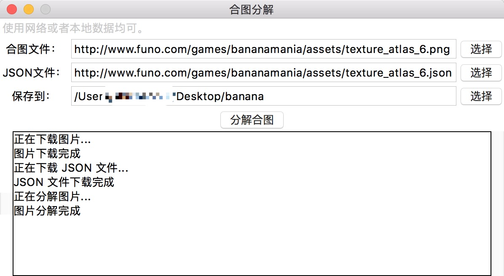

# DecomposePng
PNG 合图分解工具，该工具可以利用 JSON 配置文件将图集图片分解为单张图片。

[下载 Mac 版](./app/%E5%90%88%E5%9B%BE%E5%88%86%E8%A7%A3.app.zip?raw=true)

Windows 版请自行打包或直接运行 [decomposePng.py](./decomposePng.py) 脚本

> 示例图片：http://www.funo.com/games/bananamania/assets/texture_atlas_6.png
>
> 示例JSON：http://www.funo.com/games/bananamania/assets/texture_atlas_6.json

#修改
原项目只能分解{"frames": [{},{}]}格式的json
而我的图集json格式为{"frames": {{},{}}},故修改原作者项目代码，使得能分解我的图集并能兼容分解原格式图集，
主要是添加一个数据格式判断，不同格式不同的分解代码

